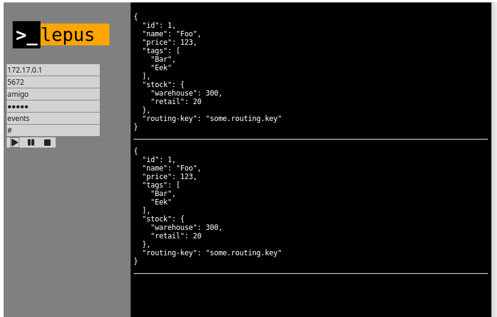

# lepus
*simply view topic exchange content from rabbitmq*



## About
Simple web application to track the content of the topic exchange in RabbitMQ

## Running

```bash
docker run -p 10555:10555 dixel/lepus:0.1.0-SNAPSHOT.1
```

```clojure
lein repl
(go)
```

## Building

```
lein cljsbuild once min
lein uberjar
docker build .
```

## License

Copyright © 2018 Avdiushkin Vasilii

Distributed under the Eclipse Public License either version 1.0 or (at
your option) any later version.

Created with [Chestnut](http://plexus.github.io/chestnut/) 0.16.0 (67651e9d).
